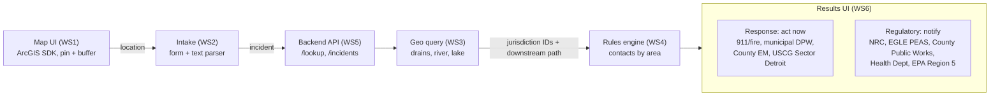
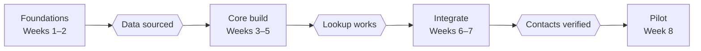

# Architecture — Clean Water Geotagging & Jurisdiction App

## Overview

A reporter enters a short summary of a water spill in Macomb County, MI (location, size, material). The app pins the spill on an ArcGIS map, finds every jurisdiction it falls in, and lists who must be contacted. Results are split into **Response** and **Regulatory** panels.

**Core flow**

1. Reporter enters location (address, coordinates, or map click), estimated size, and material type.
2. App geocodes and drops a pin; size can optionally draw an impact buffer.
3. Spatial query intersects the pin/buffer with jurisdiction layers (city/township/village, county drain district, Clinton River subwatershed, Lake St. Clair shoreline, Coast Guard sector, EPA region) and traces the downstream receiving water.
4. Rules engine maps jurisdictions × material × size to required contacts.
5. Results show two panels: Response (who acts now) and Regulatory (who must be notified, and by when).

**In scope for v1:** spills to water in Macomb County (Lake St. Clair, Clinton River and tributaries, county drains, storm sewers), single incident at a time, manual contact (call/email links), saved incident record.

**Out of scope for v1:** automated notifications, plume modeling, mobile-native apps.

## System architecture

| Layer | Technology |
| --- | --- |
| Frontend | ArcGIS Maps SDK for JavaScript 4.x |
| Backend | FastAPI (Python) |
| Database | PostgreSQL + PostGIS |
| Data | Macomb County, Michigan, and USGS (NHD/WBD) GIS layers |

Each box is one workstream. The API is the hand-off point, so WS5 publishes its endpoint contract in week 1.

## Workstreams

Six workstreams, one owner each. WS3 and WS4 are the critical path: the results are only as good as the boundary data and the contact rules.

| # | Workstream | Owner | Depends on | Key deliverable |
| --- | --- | --- | --- | --- |
| WS1 | Map & geotagging UI | | — | Map with search, click-to-pin, size buffer |
| WS2 | Incident intake & parsing | | WS5 schema | Form + free-text parser → structured incident |
| WS3 | Jurisdiction layers & spatial query | | — | Point/buffer → list of jurisdictions |
| WS4 | Contacts directory & rules engine | | WS3 jurisdiction IDs | Jurisdictions + material + size → contacts |
| WS5 | Backend API & data model | | — | REST API, DB, incident storage |
| WS6 | Results UI, QA & deployment | | WS1–WS5 | Response/Regulatory panels, tests, hosting |

### WS1 — Map & geotagging UI

**Goal:** A map where a reporter can find and pin a spill location in Macomb County in under a minute.

**Done when:** A pin placed by search or click sends its coordinates to the intake form, and the buffer and overlay layers display correctly on desktop and phone.

- [ ] **Set up the app shell**
  - Create the frontend project with ArcGIS Maps SDK for JavaScript 4.x
  - Get an ArcGIS developer API key; keep it in an env file, never in the repo
  - Show a basemap centered on Macomb County with Lake St. Clair in view
- [ ] **Add location search**
  - Add the Search widget using ArcGIS World Geocoding
  - Limit results to Macomb County so local addresses come up first
- [ ] **Pin the spill**
  - Click the map to drop a pin; drag it to adjust
  - Show latitude/longitude under the map; allow typing coordinates directly
  - Pass the pin location to the intake form (WS2)
- [ ] **Draw the impact buffer**
  - Draw a circle around the pin, sized from the spill quantity (radius table agreed with WS4)
  - Redraw when the pin moves or the size changes
- [ ] **Add overlay layers**
  - Toggle WS3 layers: municipalities, drain districts, subwatersheds, water bodies
  - Highlight the jurisdictions returned by the lookup
- [ ] **Make it field-ready**
  - Test at phone width; make buttons large enough to tap
  - Add a "Use my location" button (browser geolocation)

**Hands off to:** WS2 and WS5 (pin + buffer). **Needs from:** WS3 (layers).

### WS2 — Incident intake & parsing

**Goal:** Turn whatever the reporter enters into one clean, structured incident record.

**Done when:** The form and a one-line summary like "about 50 gallons of diesel in the Clinton River near Mount Clemens" both produce the same validated record for `POST /incidents`.

- [ ] **Agree the incident fields with WS5**
  - Location (lat/long + address), water body, material, quantity, unit, time observed, reporter name and phone, notes
- [ ] **Build the structured form**
  - Water body dropdown: Lake St. Clair, Clinton River, tributary/creek, county drain, storm sewer, unknown
  - Material dropdown: oil/fuel, chemical/hazmat, sewage, unknown/other
  - Quantity + unit (gal, bbl, L, lb); allow "unknown"
  - Location fills in from the map pin (WS1)
- [ ] **Build the free-text parser**
  - Input: one-line summary; output: the same fields as the form
  - Start with keyword/regex rules; add an LLM call only if accuracy is too low
  - Show parsed fields in the form for the reporter to confirm — never submit unconfirmed
- [ ] **Normalize and validate**
  - Convert liquid quantities to gallons for the rules engine
  - Block submit until required fields are filled
- [ ] **Map material names to categories**
  - e.g., diesel, gasoline → oil/fuel; antifreeze, paint → chemical
  - Keep the mapping in one shared JSON file used by WS4
- [ ] **Build a test set**
  - Write 20+ sample summaries with expected outputs; all must pass before the pilot

**Hands off to:** WS5 (validated incident). **Needs from:** WS1 (pin), WS4 (material categories).

### WS3 — Jurisdiction layers & spatial query

**Goal:** For any point in Macomb County, return every jurisdiction and water body the spill affects.

**Done when:** The lookup returns the correct municipality, drain district, subwatershed, receiving water, and downstream path for every boundary test case.

- [ ] **Inventory data sources**
  - Make a table: layer, source URL, format, last updated, owner
  - Check Macomb County GIS open data first, then Michigan GIS Open Data, then USGS (NHD for water, WBD for watersheds)
- [ ] **Collect the layers**
  - Municipal boundaries (cities, townships, villages)
  - County drain districts
  - Clinton River subwatersheds (HUC-12)
  - Water bodies and stream flowlines (NHD)
  - Storm sewer outfalls, if Public Works shares them
  - Lake St. Clair shoreline and the USCG/EPA response zone line
- [ ] **Load into PostGIS**
  - Reproject everything to one coordinate system (EPSG:4326)
  - Give each feature a stable jurisdiction ID that WS4 will reference
  - Add spatial indexes so lookups stay fast
- [ ] **Write the lookup query**
  - Intersect the pin (or buffer) with each boundary layer (`ST_Intersects`)
  - Return a list of {layer, jurisdiction ID, name}
- [ ] **Snap to water and trace downstream**
  - Find the nearest water feature to the pin
  - Follow NHD flowlines downstream (drain → Clinton River → Lake St. Clair) and list each water body passed
  - Flag downstream beaches and drinking-water intakes
- [ ] **Share layers with the map**
  - Publish layers for WS1 as ArcGIS feature layers or vector tiles
- [ ] **Write boundary tests**
  - At least 10 points: on municipal lines, drain district edges, the shoreline, and the Oakland/St. Clair county lines
  - Record the expected result for each

**Hands off to:** WS4 and WS5 (jurisdiction IDs + downstream path), WS1 (layers).

### WS4 — Contacts directory & rules engine

**Goal:** Given the jurisdictions and spill details, return exactly who to contact — split into Response and Regulatory — with deadlines.

**Done when:** Every test scenario returns the correct contact list, and every contact has a source link and a verified date.

- [ ] **Define the contact table**
  - Agency, role (Response or Regulatory), jurisdiction ID, phone, after-hours phone, email, hours, reporting deadline, source URL, last verified date
- [ ] **Research and seed contacts**
  - Response: 911/local fire departments, municipal DPWs, Macomb County Emergency Management, USCG Sector Detroit
  - Regulatory: National Response Center, Michigan EGLE (PEAS hotline + district office), Macomb County Public Works, Macomb County Health Department, EPA Region 5
  - Take every number from an official source page and record the URL
- [ ] **Research reporting rules**
  - For each agency: what triggers a report (oil sheen on water, CERCLA reportable quantities, Michigan Part 5 spill rules) and the deadline
  - Cite the rule for each one
- [ ] **Build the rules table**
  - One row per rule: jurisdiction type × water body × material × size threshold → contact, required/optional, deadline
- [ ] **Write the rules engine**
  - Function: (jurisdictions, incident) → contact list
  - Sort Response by urgency and Regulatory by deadline
- [ ] **Set up contact verification**
  - Re-check every contact on a set schedule (e.g., quarterly); update the verified date
- [ ] **Write scenario tests**
  - Expected contact list for each WS6 test scenario

**Hands off to:** WS5 and WS6 (contact lists). **Needs from:** WS3 (jurisdiction IDs), WS2 (material categories).

### WS5 — Backend API & data model

**Goal:** One API that ties intake, spatial lookup, and contact rules together.

**Done when:** All endpoints are deployed with docs, and the frontend can run a full lookup end to end.

- [ ] **Set up the stack**
  - FastAPI (Python) + PostgreSQL with PostGIS
  - Docker Compose for local development so everyone runs the same setup
- [ ] **Publish the API contract in week 1**
  - Define models for Incident, Jurisdiction, Contact, and LookupResult
  - Share the auto-generated API docs with WS1, WS2, and WS6
- [ ] **Build the endpoints**
  - `POST /lookup`: location + spill details → jurisdictions (WS3) + contacts (WS4)
  - `POST /incidents`: save an incident and its lookup result
  - `GET /incidents/{id}`: fetch a saved incident
  - `GET /health`: status check for hosting
- [ ] **Set up the database**
  - Tables for incidents, contacts, rules, and jurisdictions
  - Use migrations (Alembic) so schema changes are tracked
- [ ] **Add access control**
  - Login for responders; viewers are read-only
  - All keys and passwords in environment variables
- [ ] **Add an audit trail**
  - Timestamp every incident create and update
- [ ] **Write tests**
  - Unit tests for each endpoint, run automatically on every push

**Hands off to:** everyone (API URL + docs). **Needs from:** WS3 (lookup query), WS4 (rules engine).

### WS6 — Results UI, QA & deployment

**Goal:** Show the reporter a clear, actionable list of who to contact, and ship a reliable pilot.

**Done when:** All test scenarios pass end to end, and the app is live at a shareable URL.

- [ ] **Build the results panels**
  - Response panel: who to call now, in order, with click-to-call
  - Regulatory panel: who must be notified, with each deadline (e.g., "within 24 hours")
  - Show each contact's source and last verified date
- [ ] **Add an incident summary**
  - A copy-able block (location, coordinates, material, size, time) to read over the phone or paste into an email
- [ ] **Add an incident report export**
  - Printable/PDF report with a map snapshot and the contact list
- [ ] **Run end-to-end test scenarios**
  - Oil sheen on Lake St. Clair
  - Chemical release in the Clinton River
  - Discharge from a storm drain
  - Sewage overflow into a county drain
  - For each: check jurisdictions, contacts, and deadlines against WS3 and WS4's expected results
- [ ] **Deploy**
  - Automated build and deploy on every merge
  - Host the frontend as a static site and the API as a container; keep separate staging and production
- [ ] **Add a disclaimer**
  - Visible note that the app supports, but does not replace, required reporting
- [ ] **Run the pilot demo**
  - Walk the team through every scenario; log issues and assign fixes

**Needs from:** all workstreams.

## Milestones

Proposed phases; adjust weeks to the team's schedule. A phase starts only when the gate before it passes.

| Phase | Weeks | Work |
| --- | --- | --- |
| Foundations | 1–2 | WS5: stack + schema · WS3: source layers · WS4: contact schema · WS1: app shell, API key |
| Core build | 3–5 | WS1: pin + buffer · WS2: form + parser · WS3: lookup query · WS4: seed contacts |
| Integrate | 6–7 | WS4: rules engine · WS5: `/lookup` live · WS6: results panels · WS3: downstream trace |
| Pilot | 8 | WS6: test scenarios, deploy + demo · WS4: verify contacts · All: fixes + handoff |

Contacts must be verified before any pilot use.

## Risks & open questions

The biggest risk is a wrong or stale contact during a real spill, so every contact row needs a source and a verified date.

**Risks**

- Stale contacts → show "last verified" per contact; schedule re-checks (WS4).
- Boundary data gaps (drain districts, storm sewer networks) → fall back to the parent jurisdiction and flag it (WS3).
- Free-text parsing errors → always require user confirmation of parsed fields (WS2).
- ArcGIS credit/licensing limits on geocoding → cache results; confirm license tier early (WS1/WS5).
- Legal reliance → clear disclaimer that the app supports, not replaces, required reporting.

**Open questions**

- [ ] Will Macomb County Public Works share storm sewer and outfall GIS data?
- [ ] Who are the users: field responders, facility operators, or the public?
- [ ] ArcGIS Online org account, or developer API key only?
- [ ] Does v1 need saved incident history, or lookup only?
- [ ] Should size thresholds use the regulatory reportable-quantity tables from day one?
